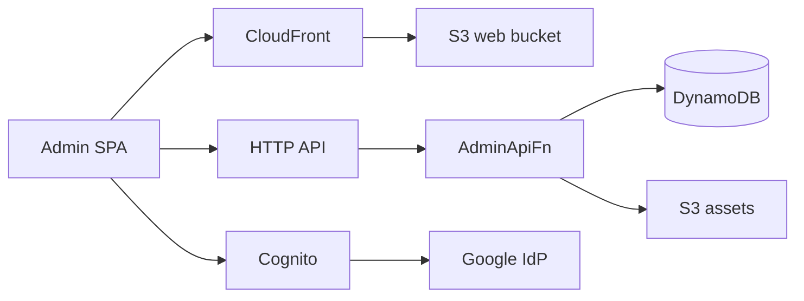
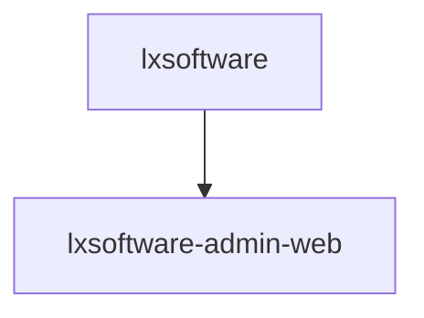

# Architecture overview

This repository ships two single-page applications and the AWS CDK app that
hosts them:

| Piece | Path | Purpose |
|-------|------|---------|
| Public website | `apps/public_www` | LX Software marketing site (Vite, React Router, TanStack Query, Bootstrap 5). Fetches `/content.json` at runtime. Contains the Siu Tin Dei newsletter form. |
| Admin console | `apps/admin_web` | Private SPA for finance books, statement import, banking sync and the Siu Tin Dei Executive Board. Same stack as the public site. |
| Infrastructure | `backend/infrastructure` | AWS CDK (TypeScript) defining the three stacks below. |
| Lambda code | `backend/lambda` | Python: admin API (`admin/`), public API key authorizer, Cognito pre-token hook, inbound-mail handlers, siutindei schema custom resource. |
| Shared contracts | `contracts/*.json` | Constants synced into Python, TypeScript and CDK by `scripts/sync-contracts.py`. |

## Stacks

| Stack | Purpose |
|-------|---------|
| `lxsoftware-public-www` | Public site: private S3 origin + CloudFront (SPA fallback on 403/404). |
| `lxsoftware` | Admin backend: Cognito (Google federation + Pre Token Generation Lambda), DynamoDB tables, private assets bucket, HTTP API + `AdminApiFn`, SES inbound rule set, KMS key for Enable Banking, Executive Board schedules and secrets. |
| `lxsoftware-admin-web` | Admin SPA delivery: S3 + CloudFront + WAF and a strict CSP. |

Physical resource names use the `lxsoftware-admin-*` prefix (tables
`lxsoftware-admin-records` and `lxsoftware-admin-audit-log`, user pool
`lxsoftware-admin-user-pool`, buckets `lxsoftware-admin-assets-*`,
`lxsoftware-admin-web-*` and their `-logs-*` counterparts, HTTP API
`lxsoftware-admin-api`, hosted UI prefix `lxsoftware-admin-auth`).
Siu Tin Dei board resources add a `siutindei` segment
(`lxsoftware-admin-siutindei-board-*`).

## Admin request flow

Operators reach CloudFront through Cloudflare DNS (gray cloud). The HTTP
API uses a Cognito JWT authorizer; every handler additionally checks the
`admin` group claim. `/public/*` routes use the API-key Lambda authorizer
instead, and `/webhooks/meta*` plus the newsletter / outreach public routes
have no authorizer (HMAC or signed tokens). Details in
[`security.md`](./security.md).

### `AdminApiFn` invoke permissions

The function sits behind 60+ routes. API Gateway gets **one** API-wide
`AWS::Lambda::Permission` (`AdminApiInvoke`, source ARN
`…/*/*/*`) through `SharedPermissionLambdaIntegration`; per-route
permissions and `events.Rule` targets exceeded the 20 KB resource-policy
limit. All schedules are EventBridge **Scheduler** schedules with an IAM
role target, and SQS uses an event source mapping.

`AdminApiFn` Event-invokes itself for staff steps, meeting phases,
chat/parse workers and crawl pages, so CDK sets `recursiveLoop: Allow` on
that function only. Application caps (`maxStepsPerTask`, meeting phase
lists, crawl page budget, daily OpenRouter budgets) bound the chain, and
the alarm `lxsoftware-admin-siutindei-admin-api-invocations` fires above
250 invocations per 5 minutes.

## CDK deploy order

`lxsoftware-admin-web` depends on `lxsoftware` for the HTTP API URL and
the two assets-bucket origins used in the CSP `connect-src`. The Cognito
OAuth origin is the plain parameter `CspCognitoConnectOrigin`, not a
cross-stack export, so `lxsoftware` can change Cognito domain resources
without blocking on stale exports.

**Deploy Backend** first runs `cdk deploy --exclusively lxsoftware-admin-web`
(so the admin template stops importing any export about to be removed),
then deploys `lxsoftware` and `lxsoftware-admin-web` together.
`--exclusively` matters: touching `lxsoftware` in that first phase with only
`lxsoftware-admin-web:*` parameters would flip the Cognito conditional
resources and clash with the live `lxsoftware-admin-auth` domain.

## CI/CD

- GitHub Actions assumes `GitHubActionsRole` through OIDC (no long-lived
  keys); setup in [`../deployment/setup.md`](../deployment/setup.md).
- **Deploy Public Website** and **Deploy Admin Web** build the SPA, sync
  `dist/` to S3 and invalidate CloudFront (`scripts/deploy/*.sh`).
- **Deploy Backend** runs `cdk deploy` when `backend/infrastructure/**`,
  `backend/lambda/**` or `contracts/**` change.
- **Test** runs Vitest, the Python unit tests, the CDK assertion tests,
  `scripts/check-contracts.py` and the Playwright viewport smoke.
- Dependabot watches the workflows and the three npm projects.

## Executive Board

The Siu Tin Dei Executive Board (AI personas, tools, staff tasks, holds,
daily review, outreach, content, engineering runner) runs entirely on
`AdminApiFn` and the records table. Its design is in
[`executive-board.md`](./executive-board.md); setup and operating steps
are in [`../deployment/admin-website.md`](../deployment/admin-website.md).
